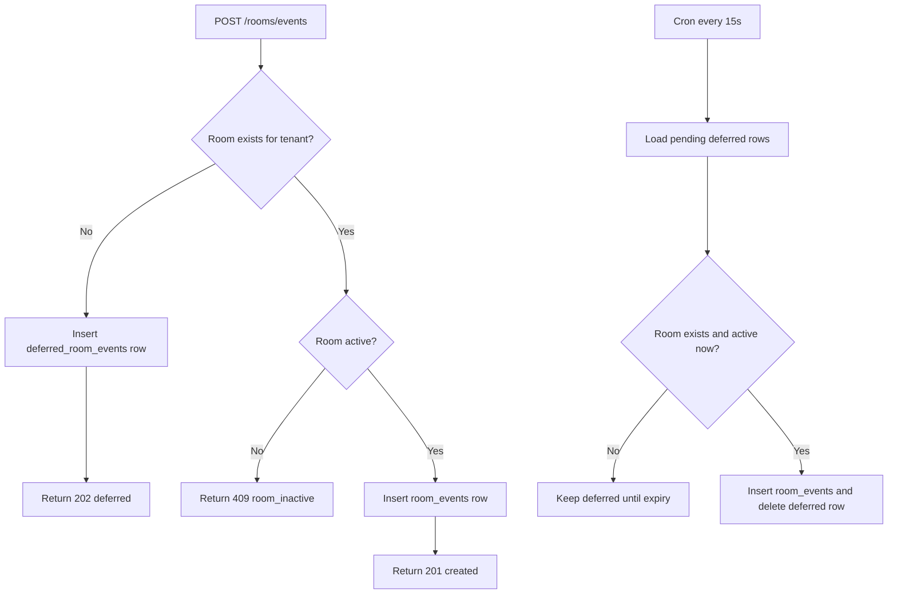

# Room Events Module

## Purpose

- Persist room lifecycle events for tenant-owned rooms.
- Accept event payloads from room processes and expose paginated event history.
- Handle out-of-order arrivals with deferred storage and scheduled reconciliation.

## Architecture

- `RoomEventsController` handles create and list routes under the `/rooms` namespace.
- `RoomEventsService` decides immediate insert versus deferred insert.
- `RoomEventsRepository` owns SQL for `room_events` and `deferred_room_events`.
- `DeferredRoomEventsScheduler` runs every 15 seconds to reconcile deferred rows.
- `RoomsRepository` is used for room existence and active-state checks.

## Request/Flow Model

## Key Files

- `room-events.controller.ts`
- `room-events.service.ts`
- `room-events.repository.ts`
- `deferred-room-events.scheduler.ts`
- `types/room-event-name.type.ts`

## Notes

- Deferred rows have TTL and are cleaned by scheduler flow.
- Event names are validated against the allowed headless event list.
