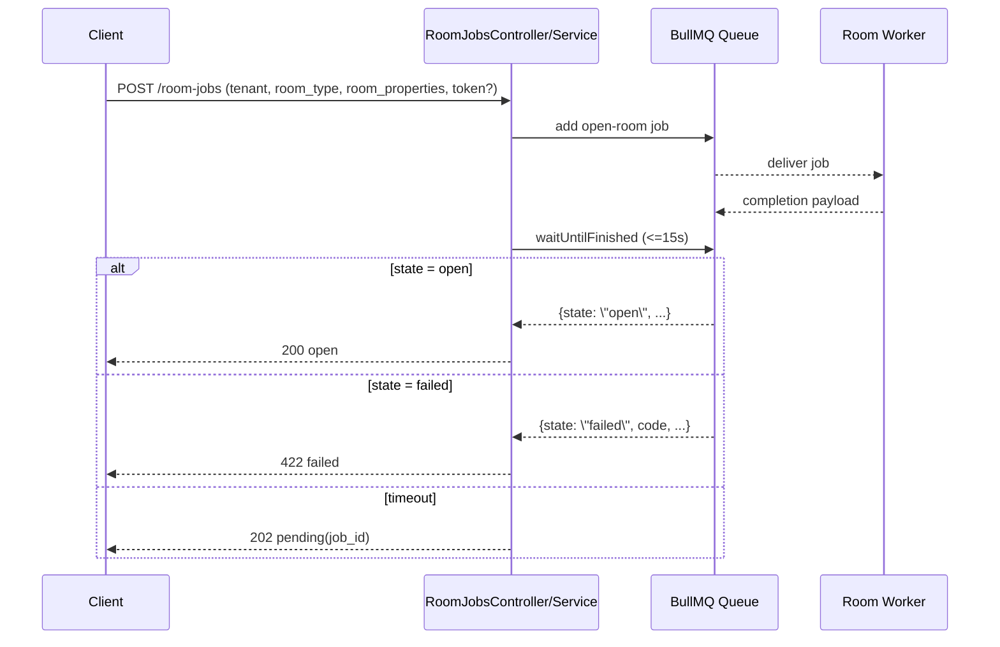

# Room Jobs Module

## Purpose

- Bridge HTTP requests to an external room worker process through BullMQ.
- Enqueue room-open jobs with tenant context and optional token passthrough.
- Return stateful HTTP responses based on completion payload or timeout.

## Architecture

- `RoomJobsController` maps job result states to HTTP status (`200`, `422`, `202`).
- `RoomJobsService` enqueues jobs, waits for completion events, and maps failures.
- Queue registration is done in `RoomJobsModule` via `@nestjs/bullmq`.
- Redis connection config is shared from environment-driven queue utilities.
- Completion payload parsing is isolated in `utils/room-job-completion.util.ts`.

## Request/Flow Model

## Key Files

- `room-jobs.controller.ts`
- `room-jobs.service.ts`
- `room-jobs.module.ts`
- `types/room-job.type.ts`
- `utils/room-job-completion.util.ts`

## Notes

- Tenant is always propagated into job payload from authenticated service token.
- Timeout does not fail the job; it returns a pending state for asynchronous completion.
